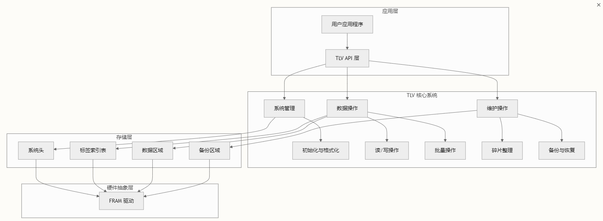
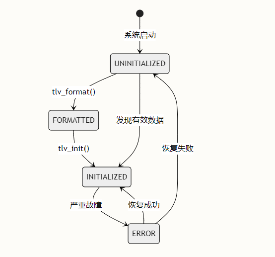
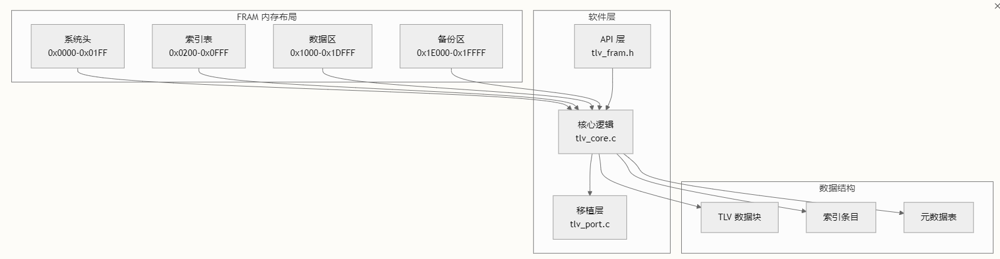
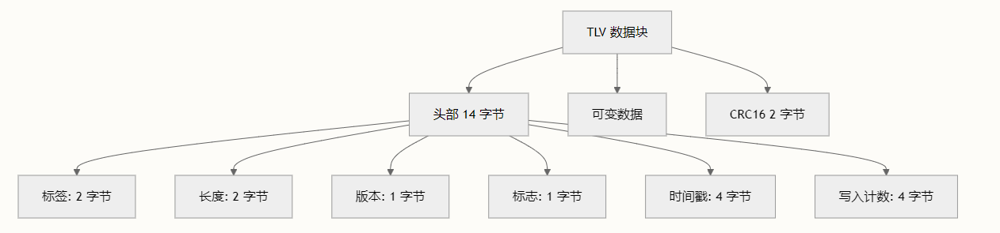
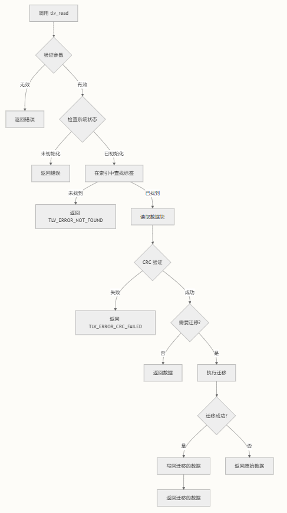
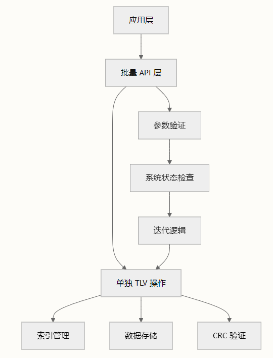
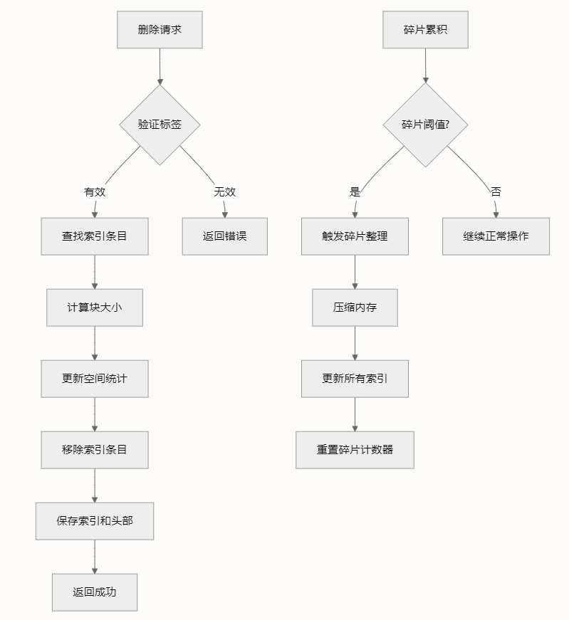
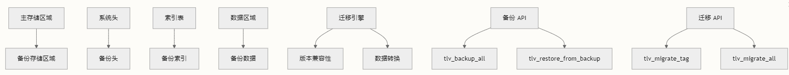
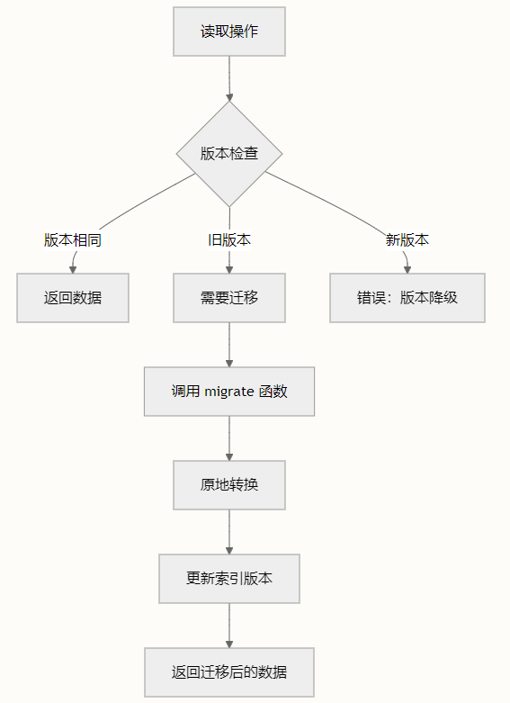

# 基于TLV架构的铁电存储文件系统

TLV (Tag-Length-Value) FRAM 系统是一个健壮、轻量级的数据存储解决方案，专为使用铁电 RAM (FRAM) 的嵌入式系统设计。该系统提供了一种结构化的持久数据管理方法，具备内置的可靠性特性，非常适合需要频繁写入和数据完整性保证的应用程序。铁电体具备10^14写入和读取寿命，设备生命周期里几乎不用考虑内存磨损和写平衡。

## 系统架构



## 核心组件

### 内存布局

系统将 FRAM 内存划分为不同的区域，每个区域在数据管理层次结构中服务于特定目的：

| 区域       | 地址范围          | 大小     | 用途                     |
| ---------- | ----------------- | -------- | ------------------------ |
| 系统头     | 0x0000 - 0x01FF   | 512 字节 | 全局系统元数据和统计信息 |
| 标签索引表 | 0x0200 - 0x0FFF   | 3.5KB    | 所有数据标签的快速查找表 |
| 数据区域   | 0x1000 - 0x1DFFF  | 118KB    | TLV 数据块的主要存储区域 |
| 备份区域   | 0x1E000 - 0x1FFFF | 8KB      | 关键数据的紧急备份区域   |

### 数据结构层次结构

系统采用 Tag-Length-Value 格式，其中每个数据项通过 16 位标签唯一标识：

```c++
/*
数据块结构:
┌─────────────────────────────────────┐
│ TLV 头部 (14 字节)		    │
│ ├─ 标签 (2 字节)                   │
│ ├─ 长度 (2 字节)                   │
│ ├─ 版本 (1 字节)                   │
│ ├─ 标志位 (1 字节)                 │
│ ├─ 时间戳 (4 字节)                 │
│ └─ 写入计数 (4 字节)               │
├─────────────────────────────────────┤
│ 用户数据 (可变长度)                │
├─────────────────────────────────────┤
│ CRC16 校验和 (2 字节)              │
└─────────────────────────────────────┘
*/
```

## 关键特性

### 可靠性机制

TLV 系统集成了多层的数据保护：

- **CRC16 验证**: 每个数据块包含 CRC16 校验和用于完整性验证
- **自动备份**: 关键数据可以自动备份到专用区域
- **错误恢复**: 内置机制用于检测和恢复损坏
- **磨损均衡**: 写入分布算法延长 FRAM 寿命

### 性能优化

- **零拷贝操作**: 直接内存访问最小化 CPU 开销
- **批量操作**: 多个读/写操作可以原子性执行
- **延迟迁移**: 数据格式升级仅在访问时发生
- **静态内存分配**: 无动态内存分配，适合裸机系统

### 版本管理

系统通过复杂的迁移框架支持模式演进：

- **版本感知标签**: 每个数据块包含版本信息
- **迁移函数**: 版本间的自动数据转换
- **向后兼容**: 升级后旧数据格式仍可访问

## 配置系统

系统通过在 [`tlv_config.h`](https://zread.ai/WuWenBo1994/inc/tlv_config.h) 中定义的编译时选项高度可配置：

| 配置项                       | 默认值   | 描述                |
| ---------------------------- | -------- | ------------------- |
| `TLV_FRAM_SIZE`            | 128KB    | FRAM 内存总大小     |
| `TLV_MAX_TAG_COUNT`        | 256      | 最大唯一标签数      |
| `TLV_BUFFER_SIZE`          | 512 字节 | 内部 I/O 缓冲区大小 |
| `TLV_AUTO_CLEAN_FRAGEMENT` | 启用     | 自动碎片整理        |
| `TLV_ENABLE_MIGRATION`     | 启用     | 版本迁移支持        |

## 集成架构

### 硬件抽象层

系统通过在 [`port/`](https://zread.ai/WuWenBo1994/port/) 目录中定义良好的移植接口隔离硬件特定代码：

- **tlv_port.c**: 硬件特定的 FRAM 驱动实现
- **tlv_port.h**: 移植接口定义
- **tlv_tag.h**: 应用程序特定的标签定义

### 元数据管理

应用程序特定的数据模式通过元数据表定义，提供：

- 用于调试的标签到名称映射
- 最大长度约束
- 备份决策的优先级
- 迁移函数指针

## 快速集成路径

对于希望集成 TLV 系统的开发者，典型的工作流程遵循以下步骤：

1. **硬件移植**: 在 [`port/tlv_port.c`](https://zread.ai/WuWenBo1994/port/tlv_port.c) 中实现 FRAM 驱动函数
2. **标签定义**: 在 [`port/tlv_tag.h`](https://zread.ai/WuWenBo1994/port/tlv_tag.h) 中定义应用程序特定标签
3. **元数据配置**: 创建描述数据模式的元数据表
4. **系统集成**: 在系统启动期间调用 [`tlv_init()`](https://zread.ai/WuWenBo1994/inc/tlv_fram.h#L30)
5. **数据操作**: 使用 [`tlv_write()`](https://zread.ai/WuWenBo1994/inc/tlv_fram.h#L50) 和 [`tlv_read()`](https://zread.ai/WuWenBo1994/inc/tlv_fram.h#L58) 进行数据持久化

## 系统生命周期

TLV 系统通过定义良好的状态机运行：



# TLV架构与内存布局

TLV（Tag-Length-Value）FRAM 存储系统实现了一个健壮的嵌入式数据管理架构，具备分层内存组织、高效索引和内置数据完整性机制。本文档探讨了在资源受限环境中实现可靠持久存储的基础架构模式和内存布局。

## 系统架构概览

TLV 系统采用分层架构方法，在内存区域、数据结构和操作层之间实现清晰的职责分离。该系统专为 FRAM（铁电 RAM）存储设计，提供快速写入速度和高耐久性特性，满足嵌入式应用需求。



## 内存布局架构

FRAM 内存被划分为不同区域，每个区域在 TLV 系统架构中 serving 特定用途 [tlv_config.h#L72-L85]：

| 内存区域 | 地址范围        | 大小     | 用途             |
| -------- | --------------- | -------- | ---------------- |
| 系统头   | 0x0000-0x01FF   | 512 字节 | 系统元数据和配置 |
| 索引表   | 0x0200-0x0FFF   | 3.5KB    | 标签到地址的映射 |
| 数据区   | 0x1000-0x1DFFF  | 116KB    | 主数据存储       |
| 备份区   | 0x1E000-0x1FFFF | 8KB      | 关键数据备份     |

### 系统头结构

系统头作为 TLV 架构的根，包含系统运行所需的基本元数据 [tlv_types.h#L35-L58]：

```c++
typedef struct
{
    uint32_t magic;             // 魔数 0x544C5646
    uint16_t version;           // 格式版本号
    uint16_t tag_count;         // 当前使用的Tag数量
    uint32_t data_region_start; // 数据区起始地址
    uint32_t data_region_size;  // 数据区大小
    uint32_t next_free_addr;    // 下一个可分配地址
    uint32_t total_writes;      // 总写入次数
    uint32_t last_update_time;  // 最后更新时间戳
    uint32_t free_space;        // 可用空间
    uint32_t used_space;        // 已用空间
    uint32_t fragment_count;    // 碎片的数量
    uint32_t fragment_size;     // 碎片的大小
    uint8_t reserved[210];      // 保留扩展
    uint16_t header_crc16;      // Header自身CRC16（改为2字节）
} tlv_system_header_t;
```

系统头使用 128 字节结构并通过 CRC16 验证确保元数据完整性。魔数（0x544C5646 或 "TLVF"）在初始化期间提供快速系统识别。

## 索引表架构

索引表实现了直接映射查找系统，无需哈希表开销即可实现 O(1) 标签解析 [tlv_types.h#L61-L72]。每个索引条目包含：

```c++
typedef struct 
{
    uint16_t tag;       // Tag值（0x0000为无效）
    uint8_t flags;      // 状态标志（1字节）
    uint8_t version;    // 数据版本号
    uint32_t data_addr; // 数据块在FRAM中的绝对地址
} tlv_index_entry_t;

/** Tag索引表结构（简化，2050字节） */
typedef struct 
{
    tlv_index_entry_t entries[TLV_MAX_TAG_COUNT];
    uint16_t index_crc16; // 索引表CRC16
} tlv_index_table_t;
```

索引表最多支持 256 个条目，在内存效率和存储容量之间取得平衡。每个条目为 8 字节，索引表总大小为 2KB。

## TLV 数据块结构

数据块遵循经典 TLV 格式，并添加额外元数据用于版本控制和完整性检查 [tlv_types.h#L85-L100]：

```c
/*
┌─────────────────────────────────────┐
│ 数据块头部（14 字节）                │
├─────────────────────────────────────┤
│ 标签（2 字节）                       │
│ 长度（2 字节）                       │
│ 版本（1 字节）                       │
│ 标志（1 字节）                       │
│ 时间戳（4 字节）                     │
│ 写入计数（4 字节）                   │
├─────────────────────────────────────┤
│ 数据有效负载（可变长度）             │
├─────────────────────────────────────┤
│ CRC16（2 字节）                      │
└─────────────────────────────────────┘
*/
```

此结构支持高效的数据验证、版本跟踪和写入操作监控。

## 配置架构

系统配置定义了架构约束和操作参数 [tlv_config.h#L14-L23]：

- **FRAM 大小**：128KB 总存储空间
- **最大标签数**：256 个并发数据项
- **缓冲区大小**：512 字节静态操作缓冲区
- **CRC 验证**：CRC16 用于数据完整性
- **迁移支持**：版本兼容性和数据迁移

配置使用编译时常量以实现优化和减少内存占用。512 字节缓冲区大小在资源受限环境中平衡了操作效率和内存使用。

## 状态管理架构

TLV 系统实现了具有明确定义操作状态的有限状态机 [tlv_types.h#L18-L25]：

| 状态          | 描述               | 有效操作                 |
| ------------- | ------------------ | ------------------------ |
| UNINITIALIZED | 系统未初始化       | tlv_init(), tlv_format() |
| INITIALIZED   | 系统就绪           | 读/写/删除操作           |
| ERROR         | 系统错误状态       | tlv_deinit(), 恢复操作   |
| FORMATTED     | 已格式化但未初始化 | tlv_init()               |

## 内存管理策略

系统采用线性分配策略和碎片管理：

1. **顺序分配**：数据块从数据区起始地址开始顺序分配
2. **碎片跟踪**：系统监控碎片计数和大小
3. **自动清理**：超过阈值时可配置自动碎片整理
4. **备份管理**：关键数据在备份区中复制

## 数据完整性架构

TLV 架构包含多层数据完整性保护：

- **CRC16 验证**：头部和数据块均包含 CRC16 校验和
- **魔数**：系统和数据块魔数用于快速验证
- **版本跟踪**：数据版本化支持迁移和兼容性检查
- **写入计数**：监控写入操作以进行磨损均衡分析

## 集成点

架构提供了清晰的集成边界：

- **硬件抽象**：移植层隔离硬件特定操作
- **API 层**：为应用程序集成提供清晰接口
- **元数据系统**：可扩展元数据框架支持应用特定数据
- **迁移框架**：内置数据结构演进支持

此架构设计使 TLV 系统能够提供可靠、高效的持久存储，同时保持对各种嵌入式应用的灵活性。

# 读写操作

TLV FRAM 系统提供强大的读写操作，内置数据完整性、版本管理和自动空间优化功能。本文档介绍构成 TLV 存储系统基础的核心数据操作。

## 核心数据操作架构

TLV 系统中的读写操作采用结构化方法，在优化 FRAM 内存特性的同时确保数据完整性。系统使用**标签-长度-值（Tag-Length-Value）**格式，结合全面的元数据管理和 CRC 验证。

### 数据块结构

每个数据操作都使用标准化的块结构，包含：



头部结构在 [`tlv_data_block_header_t`](https://zread.ai/WuWenBo1994/Tlv_Fram_System/inc/tlv_types.h#L89-L97) 中定义，为每个存储的数据项提供全面的元数据。

## 写入操作

### 主要写入函数

主要写入操作通过 [`tlv_write()`](https://zread.ai/WuWenBo1994/Tlv_Fram_System/src/tlv_core.c#L222-L420) 实现，该函数处理新数据插入和现有数据更新，具有智能空间管理功能。

```
int tlv_write(uint16_t tag, const void *data, uint16_t len)
```

#### 写入操作流程

写入操作遵循复杂的决策树：

1. **参数验证**：检查空指针、零长度和无效标签
2. **系统状态验证**：确保 TLV 系统已初始化
3. **元数据查找**：检索标签配置和约束
4. **索引搜索**：定位现有数据以进行更新操作
5. **空间分配**：确定最优存储策略
6. **数据写入**：执行具有 CRC 保护的原子写入
7. **索引更新**：维护标签到地址的映射
8. **系统统计**：更新使用指标和时间戳

#### 空间管理策略

写入操作实现智能空间分配：

| 场景           | 操作         | 条件                                 |
| -------------- | ------------ | ------------------------------------ |
| 新标签         | 分配新空间   | 标签不存在                           |
| 更新，数据更小 | 原地更新     | `new_block_size ≤ old_block_size` |
| 更新，数据更大 | 重新分配空间 | `new_block_size > old_block_size`  |

当重新分配发生时，系统通过将旧数据块标记为脏数据来自动处理碎片。这些碎片稍后由碎片整理系统清理。

#### 数据块写入过程

实际的数据写入由 [`write_data_block()`](https://zread.ai/WuWenBo1994/Tlv_Fram_System/src/tlv_core.c#L1419-L1464) 处理：

1. **头部构建**：构建包含版本和时间戳的元数据头部
2. **写入计数跟踪**：维护每个块的写入统计
3. **CRC 计算**：计算头部和数据的 CRC16
4. **原子写入**：按顺序写入头部 → 数据 → CRC

### 错误处理和恢复

写入操作包含全面的错误处理：

- **回滚机制**：如果任何写入步骤失败，系统将回滚空间分配
- **碎片跟踪**：失败的写入被跟踪为碎片，供后续清理
- **状态一致性**：系统头部和索引表原子更新

## 读取操作

### 主要读取函数

读取操作通过 [`tlv_read()`](https://zread.ai/WuWenBo1994/Tlv_Fram_System/src/tlv_core.c#L430-L526) 实现，包括内置数据验证和可选版本迁移。

```
int tlv_read(uint16_t tag, void *buf, uint16_t *len)
```

#### 读取操作流程



#### 数据块读取过程

实际的数据读取由 [`read_data_block()`](https://zread.ai/WuWenBo1994/Tlv_Fram_System/src/tlv_core.c#L1466-L1511) 处理：

1. **头部读取**：读取数据块头部
2. **长度验证**：确保缓冲区能容纳数据
3. **数据读取**：读取实际数据负载
4. **CRC 验证**：使用存储的 CRC16 验证数据完整性
5. **长度更新**：向调用者返回实际数据长度

### 延迟迁移系统

读取操作的一个关键特性是**延迟迁移**系统，当遇到较旧版本时会自动升级数据格式：

- **版本检测**：比较存储版本与元数据版本
- **原地迁移**：在提供的缓冲区内升级数据
- **自动写回**：将迁移的数据写回存储
- **优雅降级**：如果迁移失败则返回原始数据

延迟迁移确保向后兼容性，同时自动升级数据格式。这对于修改数据结构的固件更新特别有用。

## 索引管理

### 标签到地址映射

读写操作都依赖索引系统进行高效的标签查找：

- **索引结构**：[`tlv_index_entry_t`](https://zread.ai/WuWenBo1994/Tlv_Fram_System/inc/tlv_types.h#L70-L76) 提供紧凑映射
- **快速查找**：[`tlv_index_find()`](https://zread.ai/WuWenBo1994/Tlv_Fram_System/src/tlv_index.c#L163-L194) 使用优化的搜索算法
- **原子更新**：索引更改立即保存以保持一致性

### 索引条目结构

每个索引条目包含：

- **标签值**：16 位标识符
- **标志**：状态信息（有效、脏、备份等）
- **版本**：数据格式版本
- **数据地址**：FRAM 中的物理位置

## 性能考虑

### 写入优化

- **原地更新**：较小的数据更新重用现有空间
- **批处理操作**：多个写入可以分组以提高效率
- **碎片管理**：自动清理减少长期碎片

### 读取优化

- **直接索引访问**：标签查找无需线性搜索
- **CRC 验证**：确保数据完整性而无性能损失
- **延迟迁移**：仅在访问时升级数据

### 内存使用

| 操作 | 内存开销              | 性能影响       |
| ---- | --------------------- | -------------- |
| 写入 | 头部 (14B) + CRC (2B) | 最小           |
| 读取 | 临时头部存储          | 可忽略         |
| 迁移 | 原地缓冲区使用        | 取决于数据大小 |

## 集成点

读写操作与多个系统组件集成：

- **[批处理操作](https://zread.ai/WuWenBo1994/Tlv_Fram_System/7-batch-operations)**：用于高效处理多个项目
- **[数据删除和管理](https://zread.ai/WuWenBo1994/Tlv_Fram_System/8-data-deletion-and-management)**：用于空间回收
- **[CRC 验证和错误处理](https://zread.ai/WuWenBo1994/Tlv_Fram_System/12-crc-validation-and-error-handling)**：用于数据完整性
- **[版本迁移和兼容性](https://zread.ai/WuWenBo1994/Tlv_Fram_System/17-version-migration-and-compatibility)**：用于格式演进

## 最佳实践

### 写入操作

1. **验证数据**：确保数据长度不超过元数据约束
2. **处理错误**：检查返回码以获取空间或系统错误
3. **批量更新**：对多个相关写入使用批处理操作
4. **监控碎片**：定期检查碎片级别

### 读取操作

1. **缓冲区大小**：为预期数据提供足够的缓冲区空间
2. **错误检查**：验证 CRC 和迁移结果
3. **版本感知**：了解潜在的格式迁移
4. **性能规划**：考虑延迟迁移开销

读写操作构成 TLV FRAM 系统的核心，为数据持久化提供了可靠的基础，具有内置完整性检查和自动优化功能。

# 批量操作

TLV FRAM 系统中的批处理操作提供了同时读写多个数据项的高效方法，在处理多个相关数据条目时能够减少系统开销并提升性能。

## 批量读取操作

`tlv_read_batch()` 函数支持通过单次 API 调用同时读取多个 TLV 条目，显著减少单独读取操作的开销。

### 函数签名

```c++
int tlv_read_batch(const uint16_t *tags, uint16_t count,              
void **buffers, uint16_t *lengths);
```

### 参数

- **tags**: 要读取的标签标识符数组
- **count**: 数组中的标签数量
- **buffers**: 用于存储读取数据的缓冲区指针数组
- **lengths**: 缓冲区大小数组（输入）和实际读取长度（输出）

### 实现细节

批量读取操作会遍历每个标签，并在内部调用单独的 `tlv_read()` 函数 [src/tlv_core.c#L655-L677](https://zread.ai/WuWenBo1994/Tlv_Fram_System/src/tlv_core.c#L655-L677)。函数返回成功读取的条目数量，允许部分成功场景，即某些标签可能不存在或遇到错误。

### 错误处理

- 如果任何参数为 null 或 count 为零，返回 `TLV_ERROR_INVALID_PARAM`
- 如果系统未处于初始化状态，返回 `TLV_ERROR`
- 返回成功读取的条目数量（0 到 count）

## 批量写入操作

`tlv_write_batch()` 函数允许在单次操作中写入多个 TLV 条目，优化内存分配模式并减少碎片化。

### 函数签名

```c++
int tlv_write_batch(const uint16_t *tags, uint16_t count,              
const void **datas, const uint16_t *lengths);
```

### 参数

- **tags**: 要写入的标签标识符数组
- **count**: 数组中的标签数量
- **datas**: 要写入的数据指针数组
- **lengths**: 每个条目的数据长度数组

### 实现策略

与批量读取类似，写入操作会遍历每个条目并调用单独的 `tlv_write()` 函数 [src/tlv_core.c#L688-L710](https://zread.ai/WuWenBo1994/Tlv_Fram_System/src/tlv_core.c#L688-L710)。这种方法在保持数据完整性的同时，为多次写入提供了便捷的接口。

### 性能考虑

批处理操作减少了函数调用次数和参数验证开销，但每次写入操作仍会执行单独的 CRC 计算和索引表更新。为获得最佳性能，建议将经常一起访问的相关数据项分组。

## 使用示例

```c++
// 传感器校准数据的批量写入示例
float offsets[3] = {1.0f, 2.0f, 3.0f};
uint16_t tags[] = {TAG_SENSOR_OFFSET_X, TAG_SENSOR_OFFSET_Y, TAG_SENSOR_OFFSET_Z};
const void *datas[] = {&offsets[0], &offsets[1], &offsets[2]};
uint16_t lengths[] = {sizeof(float), sizeof(float), sizeof(float)};
 
// 一次操作写入所有三个偏移量
int written_count = tlv_write_batch(tags, 3, datas, lengths);
 
// 批量读取示例
void *buffers[3];
uint16_t read_lengths[3] = {sizeof(float), sizeof(float), sizeof(float)};
float read_offsets[3];
buffers[0] = &read_offsets[0];
buffers[1] = &read_offsets[1]; 
buffers[2] = &read_offsets[2];
 
int read_count = tlv_read_batch(tags, 3, buffers, read_lengths);
```

此示例来自测试套件，展示了传感器配置场景中批处理操作的典型使用模式 [test/tlv_simple_example.c#L40-L50](https://zread.ai/WuWenBo1994/Tlv_Fram_System/test/tlv_simple_example.c#L40-L50)。

## API 对比

| 操作     | 单次调用                      | 批量调用                                          | 使用场景                 |
| -------- | ----------------------------- | ------------------------------------------------- | ------------------------ |
| 读取     | `tlv_read(tag, buf, len)`   | `tlv_read_batch(tags, count, buffers, lengths)` | 多个相关配置项           |
| 写入     | `tlv_write(tag, data, len)` | `tlv_write_batch(tags, count, datas, lengths)`  | 包含多个参数的系统初始化 |
| 错误处理 | 返回成功/失败                 | 返回成功计数                                      | 部分失败场景             |

## 与系统架构的集成

批处理操作与 TLV 系统的架构组件无缝集成：



批处理操作层位于核心 TLV 操作之上，提供便捷的接口，同时利用所有底层系统功能，包括索引管理、数据验证和错误处理 [inc/tlv_fram.h#L89-L104](https://zread.ai/WuWenBo1994/Tlv_Fram_System/inc/tlv_fram.h#L89-L104)。

## 最佳实践

1. **数据分组**: 对逻辑上相关且通常一起访问的数据项使用批处理操作
2. **错误处理**: 始终检查返回值以妥善处理部分成功场景
3. **内存管理**: 确保在批处理操作前正确分配和调整所有缓冲区大小
4. **系统状态**: 在执行批处理操作前验证系统初始化状态

# 数据删除与管理

TLV FRAM 系统提供了专为内存资源有限的嵌入式系统设计的复杂数据删除和管理功能。本文档介绍了删除机制、空间恢复流程以及确保高效内存利用同时保持数据完整性的管理策略。

## 删除架构

TLV FRAM 中的删除过程采用**惰性删除**策略结合**基于索引的管理**。当数据被删除时，系统会移除索引条目，但将实际数据块保留在内存中，直到进行碎片整理。这种方法通过避免立即移动内存来优化性能，同时确保数据一致性。



## 核心删除操作

### 单标签删除

主要删除机制通过 `tlv_delete()` 函数实现 [tlv_fram.h](https://zread.ai/WuWenBo1994/Tlv_Fram_System/inc/tlv_fram.h#L64-L69)：

```c++
int tlv_delete(uint16_t tag);
```

**删除流程**：

1. **验证**：检查有效标签和系统状态 [tlv_core.c](https://zread.ai/WuWenBo1994/Tlv_Fram_System/src/tlv_core.c#L536-L540)
2. **索引查找**：使用 `tlv_index_find()` 定位标签的索引条目 [tlv_core.c](https://zread.ai/WuWenBo1994/Tlv_Fram_System/src/tlv_core.c#L543-L547)
3. **块大小计算**：读取数据块头部以确定确切的内存占用 [tlv_core.c](https://zread.ai/WuWenBo1994/Tlv_Fram_System/src/tlv_core.c#L550-L556)
4. **统计更新**：更新已用空间和碎片计数器 [tlv_core.c](https://zread.ai/WuWenBo1994/Tlv_Fram_System/src/tlv_core.c#L558-L562)
5. **索引移除**：通过 `tlv_index_remove()` 清除索引条目 [tlv_core.c](https://zread.ai/WuWenBo1994/Tlv_Fram_System/src/tlv_core.c#L565-L569)
6. **持久化**：保存索引表和系统头部以防止"幽灵数据" [tlv_core.c](https://zread.ai/WuWenBo1994/Tlv_Fram_System/src/tlv_core.c#L571-L576)

删除过程会立即持久化索引表和系统头部，以防止孤立数据块。这确保了即使在删除操作期间发生断电，也能保持数据一致性。

### 索引管理

索引移除过程有效地清除标签条目，同时保持表完整性 [tlv_index.c](https://zread.ai/WuWenBo1994/Tlv_Fram_System/src/tlv_index.c#L387-L422)：

```c++
int tlv_index_remove(tlv_context_t *ctx, uint16_t tag)
{
    // 查找并验证索引条目
    tlv_index_entry_t *index = tlv_index_find(ctx, tag);
    if (!index || !(index->flags & TLV_FLAG_VALID)) {
        return TLV_ERROR_NOT_FOUND;
    }
  
    // 清除索引条目并更新计数器
    memset(index, 0, sizeof(tlv_index_entry_t));
    ctx->header->tag_count--;
  
    return TLV_OK;
}
```

## 内存碎片管理

### 碎片跟踪

系统在系统头部维护详细的碎片统计信息 [tlv_types.h](https://zread.ai/WuWenBo1994/Tlv_Fram_System/inc/tlv_types.h#L58-L59)：

- **fragment_count**：产生间隙的已删除数据块数量
- **fragment_size**：碎片块占用的总内存

碎片计算提供实时内存效率指标 [tlv_core.c](https://zread.ai/WuWenBo1994/Tlv_Fram_System/src/tlv_core.c#L1274-L1302)：

```c++
int tlv_calculate_fragmentation(uint32_t *fragmentation_percent)
{
    uint32_t allocated = g_tlv_ctx.header->next_free_addr - TLV_DATA_ADDR;
    uint32_t used = g_tlv_ctx.header->used_space;
    uint32_t wasted = allocated - used;
  
    *fragmentation_percent = (wasted * 100) / g_tlv_ctx.header->data_region_size;
    return TLV_OK;
}
```

### 碎片整理过程

当碎片达到不可接受的水平时，系统通过 `tlv_defragment()` 执行全面的内存压缩 [tlv_core.c](https://zread.ai/WuWenBo1994/Tlv_Fram_System/src/tlv_core.c#L861-L1026)：

**碎片整理策略**：

1. **索引排序**：按数据地址对索引表排序以便顺序处理 [tlv_core.c](https://zread.ai/WuWenBo1994/Tlv_Fram_System/src/tlv_core.c#L879-L893)
2. **顺序压缩**：移动有效数据块以消除间隙 [tlv_core.c](https://zread.ai/WuWenBo1994/Tlv_Fram_System/src/tlv_core.c#L918-L950)
3. **索引更新**：使用新地址更新所有受影响的索引条目 [tlv_core.c](https://zread.ai/WuWenBo1994/Tlv_Fram_System/src/tlv_core.c#L946-L948)
4. **统计重置**：清除碎片计数器并更新空间指标 [tlv_core.c](https://zread.ai/WuWenBo1994/Tlv_Fram_System/src/tlv_core.c#L952-L960)

碎片整理使用分块内存操作来处理嵌入式系统静态缓冲区限制内的大数据块，确保即使在有限的 RAM 下也能可靠运行。

## 空间监控和查询

### 实时空间信息

系统提供全面的空间监控功能：

**可用空间查询** [tlv_core.c](https://zread.ai/WuWenBo1994/Tlv_Fram_System/src/tlv_core.c#L1234-L1248)：

```c++
int tlv_get_free_space(uint32_t *free_space);
```

**已用空间跟踪** [tlv_core.c](https://zread.ai/WuWenBo1994/Tlv_Fram_System/src/tlv_core.c#L1250-L1264)：

```c++
int tlv_get_used_space(uint32_t *used_space);
```

**碎片分析** [tlv_core.c](https://zread.ai/WuWenBo1994/Tlv_Fram_System/src/tlv_core.c#L1266-L1302)：

```c++
int tlv_calculate_fragmentation(uint32_t *fragmentation_percent);
```

### 综合统计

对于详细的系统分析，`tlv_get_statistics()` 函数提供内存利用率和系统健康状态的完整概览 [tlv_fram.h](https://zread.ai/WuWenBo1994/Tlv_Fram_System/inc/tlv_fram.h#L135-L141)：

| 统计项           | 描述                   | 目的           |
| ---------------- | ---------------------- | -------------- |
| total_tags       | 总配置标签数           | 系统容量规划   |
| valid_tags       | 当前活动标签数         | 数据清单管理   |
| dirty_tags       | 已修改但未保存的标签数 | 缓存管理       |
| free_space       | 可用内存字节数         | 资源分配       |
| used_space       | 占用内存字节数         | 容量监控       |
| fragmentation    | 浪费百分比             | 性能优化       |
| corruption_count | 损坏条目数             | 数据完整性评估 |

## 数据生命周期管理

### 标签存在性验证

在尝试删除之前，系统提供高效的标签存在性检查 [tlv_fram.h](https://zread.ai/WuWenBo1994/Tlv_Fram_System/inc/tlv_fram.h#L85-L90)：

```c++
bool tlv_exists(uint16_t tag);
```

此函数执行快速索引查找而无需内存访问，为条件删除操作提供快速验证。

### 批量操作

为高效管理多个删除操作，系统支持可将多个删除操作合并到单个事务周期中的批量操作 [tlv_fram.h](https://zread.ai/WuWenBo1994/Tlv_Fram_System/inc/tlv_fram.h#L103-L114)：

```c++
int tlv_read_batch(const uint16_t *tags, uint16_t count, 
                   void **buffers, uint16_t *lengths);
int tlv_write_batch(const uint16_t *tags, uint16_t count,
                    const void **datas, const uint16_t *lengths);
```

## 错误处理和恢复

### 删除错误条件

删除 API 为不同的失败场景提供特定的错误代码：

- **TLV_ERROR_INVALID_PARAM**：无效标签（0）或空参数
- **TLV_ERROR_NOT_FOUND**：标签不存在或已删除
- **TLV_ERROR**：系统未初始化或处于错误状态

### 自动恢复

系统包含删除操作的自动恢复机制：

1. **头部验证**：CRC 验证确保系统头部完整性
2. **索引验证**：索引表一致性检查防止孤立条目
3. **备份系统**：在重大操作前自动创建备份

## 最佳实践

### 高效删除策略

1. **批量删除**：在触发碎片整理前对多个删除操作进行分组
2. **碎片监控**：使用 `tlv_calculate_fragmentation()` 定期检查碎片水平
3. **空间规划**：使用 `tlv_get_statistics()` 进行容量规划和优化

### 性能考虑

- **惰性删除**：系统在删除期间避免立即移动内存以提高性能
- **分块操作**：大数据块以可配置的块大小进行处理
- **索引优化**：排序的索引表实现高效的顺序碎片整理

### 数据完整性

- **原子操作**：索引和头部更新以原子方式执行
- **CRC 验证**：所有关键结构都包含校验和验证
- **备份系统**：自动备份创建可防止损坏

## 与系统集成

数据删除与其他系统管理功能无缝集成：

- **[初始化和格式化](https://zread.ai/WuWenBo1994/Tlv_Fram_System/9-initialization-and-formatting)**：正确的系统设置确保可靠的删除操作
- **[碎片整理和空间优化](https://zread.ai/WuWenBo1994/Tlv_Fram_System/11-defragmentation-and-space-optimization)**：超越基本删除的全面空间恢复
- **[备份和恢复系统](https://zread.ai/WuWenBo1994/Tlv_Fram_System/10-backup-and-recovery-systems)**：删除操作期间的数据保护
- **[统计和监控](https://zread.ai/WuWenBo1994/Tlv_Fram_System/14-statistics-and-monitoring)**：实时查看删除影响

TLV FRAM 删除系统为资源有限的嵌入式环境提供了强大、高效的数据管理，同时保持高可靠性和性能标准。

# 初始化与格式化

TLV FRAM 系统提供了一个强大的初始化和格式化框架，确保在不同部署场景下的数据完整性和系统可靠性。本文档涵盖了完整的初始化生命周期、格式化流程和状态管理机制。

## 系统初始化流程

TLV 系统初始化遵循多阶段流程，处理从首次设置到错误恢复的各种部署场景。主要入口点 `tlv_init()` [tlv_fram.h#L42] 执行全面的系统验证和设置。

### 初始化状态和结果

系统在整个生命周期中保持不同的状态，并提供详细的初始化结果：

| 状态                        | 描述                   | 转换条件             |
| --------------------------- | ---------------------- | -------------------- |
| `TLV_STATE_UNINITIALIZED` | 系统尚未初始化         | 初始状态或去初始化后 |
| `TLV_STATE_INITIALIZED`   | 系统准备就绪           | 成功初始化/恢复      |
| `TLV_STATE_FORMATTED`     | 系统已格式化但未初始化 | 格式化调用后         |
| `TLV_STATE_ERROR`         | 系统处于错误状态       | 严重故障             |

| 初始化结果              | 含义           | 下一步操作       |
| ----------------------- | -------------- | ---------------- |
| `TLV_INIT_FIRST_BOOT` | 首次系统启动   | 系统准备格式化   |
| `TLV_INIT_OK`         | 正常成功初始化 | 准备运行         |
| `TLV_INIT_RECOVERED`  | 从备份恢复     | 系统可操作       |
| `TLV_INIT_ERROR`      | 初始化失败     | 需要格式化或修复 |

### 初始化流程

初始化流程 [tlv_core.c#L42-L105] 从通过 `tlv_port_fram_init()` 进行硬件抽象层初始化开始。硬件设置成功后，系统使用预分配的结构 `g_static_header` 和 `g_static_index` [tlv_core.c#L24-L25] 建立静态内存上下文。

### 系统头管理

系统头作为整个 TLV 文件系统的元数据锚点，包含关键的结构信息：

- **魔数**: 系统标识（"TLVF" 对应 `0x544C5646`）[tlv_config.h#L91]
- **版本信息**: 格式版本兼容性检查
- **内存布局**: 数据区域边界和分配跟踪
- **统计信息**: 使用指标和碎片计数器
- **CRC 保护**: 头信息完整性验证

头结构 [tlv_types.h#L42-L59] 为 128 字节，包含为未来扩展保留的空间。所有头操作都包含 CRC16 验证 [tlv_core.c#L1366-L1396] 以确保数据完整性。

## 系统格式化

`tlv_format()` 函数 [tlv_core.c#L128-L208] 提供全面的存储介质准备，建立干净的文件系统基础。此操作具有破坏性，将擦除所有现有数据。

### 格式化流程


### 格式化步骤

1. **状态验证**: 确保系统处于可格式化状态
2. **头初始化**: 使用默认值创建新的系统头 [tlv_core.c#L1303-L1330]
3. **索引系统设置**: 初始化空的索引表结构
4. **持久化存储**: 将头和索引写入 FRAM
5. **备份创建**: 建立管理区域的初始备份
6. **状态转换**: 将系统设置为 `TLV_STATE_FORMATTED`

格式化流程包括管理区域的自动备份创建。这确保即使在格式化之后，系统仍保持对关键元数据结构的恢复能力。

## 内存布局和地址配置

TLV 系统使用针对 FRAM 特性优化的固定内存布局：

| 区域     | 起始地址    | 大小      | 用途         |
| -------- | ----------- | --------- | ------------ |
| 系统头   | `0x0000`  | 512 字节  | 系统元数据   |
| 索引表   | `0x0200`  | 2050 字节 | 标签索引条目 |
| 数据区域 | `0x1000`  | ~112KB    | TLV 数据块   |
| 备份区域 | `0x1E000` | 8KB       | 系统备份     |

数据区域大小计算为 `TLV_BACKUP_ADDR - TLV_DATA_ADDR` [tlv_config.h#L75-L79]，在 128KB FRAM 配置中为用户数据提供约 112KB 空间。

## 错误处理和恢复

初始化系统集成了多层错误检测和恢复机制：

### 验证机制

- **CRC16 保护**: 系统头和索引表都包含 CRC 验证
- **魔数验证**: 确保正确的文件系统标识
- **版本兼容性**: 操作前检查格式版本兼容性
- **地址范围验证**: 防止越界内存访问

### 恢复策略

1. **索引表恢复**: 如果检测到索引损坏，系统尝试从备份区域自动恢复 [tlv_core.c#L75-L85]
2. **头恢复**: 系统头验证包括多个完整性检查
3. **状态管理**: 清晰的状态转换防止在无效条件下操作

系统在备份区域维护关键元数据的双副本。这种冗余能够在大多数损坏场景下实现自动恢复而不会丢失数据。

## 与系统生命周期的集成

理解初始化和格式化对于正确的系统集成至关重要：

- **首次部署**: 调用 `tlv_format()` 后跟 `tlv_init()` 来准备新硬件
- **正常操作**: 系统启动时调用 `tlv_init()` 并检查返回码
- **错误恢复**: 适当处理 `TLV_INIT_RECOVERED` 结果
- **系统重置**: 系统关闭或重启前使用 `tlv_deinit()`

有关完整的操作流程，请参考 [系统状态和生命周期](https://zread.ai/WuWenBo1994/Tlv_Fram_System/3-system-states-and-lifecycle)，有关硬件特定要求，请参阅 [移植和硬件集成](https://zread.ai/WuWenBo1994/Tlv_Fram_System/4-porting-and-hardware-integration)。

初始化和格式化子系统为可靠的 TLV 数据操作提供了基础，确保在电源循环和错误条件下的系统完整性。

# 备份与恢复系统

TLV FRAM 系统提供了全面的备份和恢复机制，旨在确保嵌入式环境中的数据完整性和系统弹性。本文档探讨了结合数据迁移能力和完整系统备份/恢复功能的双层方法。

## 系统架构概述

备份和恢复系统基于双层架构运行：



系统从地址 `0x1E000` [tlv_config.h#L85] 开始分配专用备份空间，提供包括系统头、索引表和所有数据结构在内的管理区域的完整副本 [tlv_core.c#L1529-L1568]。

## 完整系统备份

备份系统通过 `tlv_backup_all()` 函数 [tlv_fram.h#L164-L168] 提供原子性的全系统备份能力。实现采用分块方法高效处理大数据区域：

```c++
int tlv_backup_all(void)
{
    // 状态验证确保系统一致性
    if (g_tlv_ctx.state != TLV_STATE_INITIALIZED &&
        g_tlv_ctx.state != TLV_STATE_FORMATTED)
    {
        return TLV_ERROR;
    }
  
    // 内部备份执行，带时间戳跟踪
    int ret = tlv_backup_all_internal();
    if (ret == TLV_OK)
    {
        g_tlv_ctx.header->last_update_time = tlv_port_get_timestamp_s();
        system_header_save();
    }
    return ret;
}
```

内部备份过程 [tlv_core.c#L1529-L1568] 使用配置的缓冲区大小（`TLV_BUFFER_SIZE = 512 bytes`）[tlv_config.h#L44] 系统性地复制整个管理区域，确保资源受限环境中的内存效率。

## 系统恢复和还原

恢复机制通过 `tlv_restore_from_backup()` [tlv_core.c#L1141-L1233] 提供全面的数据恢复。恢复过程包括多层验证：

1. **头完整性验证**：验证幻数和 CRC 校验和
2. **数据一致性检查**：确保备份大小与预期区域匹配
3. **分块恢复**：以可管理的段恢复数据
4. **系统重新初始化**：还原后重新加载头和索引表

恢复过程在应用更改前执行广泛验证，确保损坏的备份不会损坏主系统。CRC 验证 [tlv_core.c#L1170-L1177] 和幻数验证 [tlv_core.c#L1155-L1162] 提供多层保护以防止数据损坏。

## 数据迁移系统

除了完整的系统备份，TLV 系统还包括一个复杂的迁移引擎，用于处理版本升级和数据格式演进。迁移系统在两个级别上运行：

### 单个标签迁移

`tlv_migrate_tag()` 函数 [tlv_migration.c#L57-L149] 处理单个标签迁移，包含全面验证：

```c++
int tlv_migrate_tag(uint16_t tag, void *data, uint16_t old_len, 
                    uint16_t *new_len, uint16_t max_size, uint8_t current_ver)
{
    // 版本兼容性检查
    if (current_ver == meta->version) {
        *new_len = old_len; // 无需迁移
        return TLV_OK;
    }
  
    // 防止版本降级
    if (current_ver > meta->version) {
        return TLV_ERROR_VERSION;
    }
  
    // 执行迁移，带大小验证
    int ret = meta->migrate(data, old_len, new_len, max_size, 
                           current_ver, meta->version);
    return ret;
}
```

### 系统范围迁移

`tlv_migrate_all()` 函数 [tlv_migration.c#L150-L270] 提供批量迁移能力，具有智能缓冲区管理和错误跟踪：

- **基于栈的缓冲区**用于小数据（≤256 字节）
- **静态缓冲区**用于中等大小的数据
- **跳过逻辑**用于过大或不可迁移的条目
- **全面统计**跟踪迁移成功/失败率

迁移系统维护全局计数器 `g_migrated_count` 和 `g_failed_count` [tlv_migration.c#L18-L19] 以提供详细的迁移统计信息，支持系统监控和迁移过程调试。

## 配置和自定义

备份和恢复系统提供多个配置选项：

| 配置选项                     | 默认值  | 用途                   |
| ---------------------------- | ------- | ---------------------- |
| `TLV_ENABLE_MIGRATION`     | 1       | 启用/禁用迁移功能      |
| `TLV_LAZY_MIGRATE_ON_READ` | 1       | 在读取操作期间执行迁移 |
| `TLV_AUTO_MIGRATE_ON_BOOT` | 0       | 系统启动时自动迁移     |
| `TLV_BACKUP_ADDR`          | 0x1E000 | 备份区域起始地址       |

系统支持多个幻数用于不同的部署场景 [tlv_config.h#L97-L101]：

- `DEFAULT_TLV_SYSTEM_MAGIC` (0x544C5646) 用于标准部署
- `WRGV_TLV_SYSTEM_MAGIC` (0x57524756) 用于 WRGV 变体
- `LRGV_TLV_SYSTEM_MAGIC` (0x4C524756) 用于 LRGV 变体

## 错误处理和恢复

备份和恢复系统实现全面的错误处理：

- **状态验证**：确保系统处于适当状态进行操作
- **CRC 验证**：检测备份/恢复期间的数据损坏
- **大小验证**：防止缓冲区溢出和内存损坏
- **版本管理**：处理版本兼容性并防止降级

错误代码明确定义 [tlv_config.h#L107-L119] 以提供精确的诊断信息用于故障排除。

## 与系统生命周期的集成

备份和恢复系统与 TLV 系统生命周期无缝集成：

1. **初始化**：系统启动期间检查有效备份
2. **正常操作**：可根据系统需求安排定期备份
3. **迁移事件**：版本升级触发迁移过程
4. **恢复场景**：从验证的备份恢复系统

有关系统状态和生命周期管理的详细信息，请参阅 [系统状态和生命周期](https://zread.ai/WuWenBo1994/Tlv_Fram_System/3-system-states-and-lifecycle)。有关初始化过程，请参阅 [初始化和格式化](https://zread.ai/WuWenBo1994/Tlv_Fram_System/9-initialization-and-formatting)。

## 最佳实践

- **定期备份**：根据应用程序关键性实施定期备份计划
- **验证测试**：在开发环境中测试恢复程序
- **迁移规划**：仔细规划数据迁移以确保兼容性
- **监控**：利用迁移统计跟踪系统健康状况
- **版本管理**：维护清晰的版本编号和迁移路径

备份和恢复系统为嵌入式应用中的数据完整性和系统弹性提供了坚实的基础，确保关键数据即使在具有挑战性的操作环境中也受到保护且可恢复。

# 碎片整理与空间优化

TLV FRAM 系统实现了一套精密的碎片整理机制，以维持最优的内存利用率，并防止频繁的写入/删除操作导致的空间劣化。该过程通过系统性地重组数据块来消除碎片并回收浪费的内存。

## 碎片分析与检测

系统通过统计跟踪持续监控碎片化程度，并提供 API 评估内存效率。当数据删除在有效数据块之间留下间隙，导致空间无法被充分利用时，就会产生碎片。

### 碎片计算

系统将碎片计算为已分配数据区域内浪费空间的百分比：

```c++
uint32_t allocated = g_tlv_ctx.header->next_free_addr - TLV_DATA_ADDR;
uint32_t used = g_tlv_ctx.header->used_space;
uint32_t wasted = allocated - used;
*fragmentation_percent = (wasted * 100) / g_tlv_ctx.header->data_region_size;
```

[tlv_calculate_fragmentation()](https://zread.ai/WuWenBo1994/Tlv_Fram_System/src/tlv_core.c#L1274-L1300) 中的计算为判断何时需要碎片整理提供了明确的指标。系统在系统头 [tlv_system_header_t](https://zread.ai/WuWenBo1994/Tlv_Fram_System/inc/tlv_types.h#L62-L63) 中同时跟踪碎片数量和大小，以维护精确的碎片统计信息。

### 碎片来源

碎片主要来源于：

1. **数据删除操作**：当通过 [tlv_delete()](https://zread.ai/WuWenBo1994/Tlv_Fram_System/src/tlv_core.c#L533-L577) 删除标签时，系统会移除索引条目但无法立即回收物理空间，在内存布局中留下间隙
2. **数据更新**：修改后的数据通常被写入新位置，使旧数据块成为孤立碎片
3. **可变长度数据**：不同大小的数据块创建不规则的内存模式，自然导致碎片化

系统在删除操作期间通过递增 `fragment_count` 并在系统头中累加 `fragment_size` 来跟踪碎片创建，实现精确的碎片监控。

## 碎片整理过程

[tlv_defragment()](https://zread.ai/WuWenBo1994/Tlv_Fram_System/src/tlv_core.c#L861-L1020) 中的核心碎片整理算法实现了一个全面的内存重组过程，该过程压缩有效数据并消除所有碎片。

### 算法概述


### 索引表优化

在移动任何数据块之前，系统通过 [sort_index_table_inplace()](https://zread.ai/WuWenBo1994/Tlv_Fram_System/src/tlv_core.c#L798-L852) 执行关键的索引表优化：

1. **压缩**：所有有效条目被移至索引表开头，消除已删除条目造成的间隙
2. **基于地址的排序**：有效条目按其物理内存地址排序，确保顺序处理
3. **清理**：清除剩余槽位以维护干净的索引结构

此优化确保数据块按物理内存顺序处理，这对高效压缩至关重要。

### 数据块重定位

碎片整理过程系统性地将每个数据块移动到其最优位置：

```c++
if (entry->data_addr != write_pos) {
    // 使用静态缓冲区的分块数据移动
    uint32_t remaining = block_size;
    uint32_t src_offset = 0;
  
    while (remaining > 0) {
        uint32_t chunk_size = (remaining > TLV_BUFFER_SIZE) ? TLV_BUFFER_SIZE : remaining;
  
        // 从当前位置读取
        ret = tlv_port_fram_read(entry->data_addr + src_offset, g_tlv_ctx.static_buffer, chunk_size);
  
        // 写入新的压缩位置
        ret = tlv_port_fram_write(write_pos + src_offset, g_tlv_ctx.static_buffer, chunk_size);
  
        src_offset += chunk_size;
        remaining -= chunk_size;
    }
  
    // 将索引更新到新位置
    entry->data_addr = write_pos;
    entry->flags &= ~TLV_FLAG_DIRTY;
}
```

使用 `TLV_BUFFER_SIZE` 的分块移动可防止在大块传输期间内存耗尽，并确保与 RAM 有限的系统兼容。

## 系统状态恢复

数据压缩后，系统执行全面的状态更新以反映新的内存布局：

### 头同步

系统头使用新的内存统计信息更新：

- `next_free_addr`：设置为压缩数据的末尾
- `free_space`：计算为剩余区域容量
- `used_space`：更新以反映实际数据消耗量
- `fragment_count` 和 `fragment_size`：重置为零

### 索引一致性

索引表被保存到 FRAM 以持久化新的数据位置，确保后续操作引用正确的内存地址。

## 性能考虑

### 内存效率

碎片整理消除了数据块之间的所有浪费空间，实现了最优的内存利用率。该过程在 FRAM 系统中特别有价值，因为与闪存相比，其内存相对昂贵。

### 时间复杂度

碎片整理算法以 O(n) 复杂度运行，其中 n 是有效数据块的数量。排序阶段增加了 O(m log m) 复杂度，其中 m 是有效条目数，但由于标签数量有限，这通常很小。

### 安全机制

系统实现了几个安全功能：

- **状态验证**：确保系统在继续之前处于 `TLV_STATE_INITIALIZED` 状态
- **分块操作**：防止在大块传输期间缓冲区溢出
- **原子更新**：头和索引被原子保存以维护一致性

## 与系统管理的集成

碎片整理与其他系统管理操作无缝集成：

### 备份协调

碎片整理后，系统自动创建关键管理区域的备份，以防止电源丢失或损坏。

### 统计监控

更新的统计信息提供准确的碎片指标，使应用程序能够根据使用模式做出有关何时触发碎片整理的明智决策。

### 错误恢复

如果碎片整理失败，系统保持先前状态，确保数据完整性在过程中永远不会受到影响。

碎片整理系统为在 TLV FRAM 系统中维持长期内存效率提供了坚实的基础，即使在密集的写入/删除周期下也能确保可靠运行。

# 系统配置选项

TLV FRAM 系统提供全面的配置选项，允许开发者根据特定应用需求自定义系统行为、内存布局和操作特性。该配置系统通过编译时和运行时参数实现对性能、内存使用和功能集的精细调整。

## 核心系统配置

### 版本和基本设置

系统版本信息在配置层次的顶部定义，提供版本跟踪和兼容性管理 [tlv_config.h#L10-L16]：

```c++
#define TLV_FILE_SYSTEM_VERSION_MAJOR   0
#define TLV_FILE_SYSTEM_VERSION_MINOR   1
#define TLV_FILE_SYSTEM_VERSION_PATCH   0
```

### 内存和性能配置

基本系统参数控制内存分配和操作限制：

| 配置项                | 默认值    | 描述             | 影响                    |
| --------------------- | --------- | ---------------- | ----------------------- |
| `TLV_FRAM_SIZE`     | 128KB     | FRAM 内存总大小  | 决定可用存储容量        |
| `TLV_MAX_TAG_COUNT` | 256       | 支持的最大标签数 | 限制数据组织复杂度      |
| `TLV_BUFFER_SIZE`   | 512 bytes | 静态读写缓冲区   | 影响 I/O 性能和内存使用 |

系统通过编译时检查强制执行最低要求。例如，由于简化的索引系统，FRAM 大小必须至少为 64KB，标签数不能超过 256 个 [tlv_config.h#L125-L131]。

### 功能启用/禁用选项

配置系统允许选择性地启用功能以优化内存占用和性能：

| 功能         | 配置项                       | 默认值 | 使用场景       |
| ------------ | ---------------------------- | ------ | -------------- |
| CRC 验证     | `TLV_USE_CRC16`            | 启用   | 数据完整性验证 |
| 线程安全     | `TLV_THREAD_SAFE`          | 禁用   | 多线程环境     |
| 版本迁移     | `TLV_ENABLE_MIGRATION`     | 启用   | 向后兼容性     |
| 自动碎片整理 | `TLV_AUTO_CLEAN_FRAGEMENT` | 启用   | 空间优化       |
| 调试模式     | `TLV_DEBUG`                | 禁用   | 开发和故障排除 |

## 内存布局配置

### 地址空间组织

系统使用固定的内存布局，将 FRAM 地址空间划分为功能区域 [tlv_config.h#L73-L89]：


| 区域   | 起始地址 | 大小      | 用途             |
| ------ | -------- | --------- | ---------------- |
| 系统头 | 0x0000   | 512 bytes | 系统元数据和状态 |
| 索引表 | 0x0200   | 3.5KB     | 标签索引条目     |
| 数据区 | 0x1000   | 112KB     | 主要数据存储     |
| 备份区 | 0x1E000  | 8KB       | 恢复和备份数据   |

### 魔数和系统标识

系统使用魔数来识别不同的系统状态和配置 [tlv_config.h#L91-L100]：

- `DEFAULT_TLV_SYSTEM_MAGIC` (0x544C5646): "TLVF" - 标准系统标识符
- `WRGV_TLV_SYSTEM_MAGIC` (0x57524756): "WRGV" - 写入恢复状态
- `LRGV_TLV_SYSTEM_MAGIC` (0x4C524756): "LRGV" - 大恢复状态

魔数系统支持在初始化期间自动检测系统状态，从而根据最后已知的系统条件执行适当的恢复程序。

## 碎片整理配置

### 自动空间管理

系统包含可配置的自动碎片整理功能，以保持最佳内存利用率 [tlv_config.h#L58-L67]：

| 参数                                | 默认值 | 描述         |
| ----------------------------------- | ------ | ------------ |
| `TLV_AUTO_CLEAN_FRAGEMENT_NUMBER` | 10     | 碎片数量阈值 |
| `TLV_AUTO_CLEAN_FRAGEMENT_SIZE`   | 20KB   | 碎片大小阈值 |

当任一阈值超过时，系统会自动触发碎片整理以整合空闲空间并提高性能。

## 错误处理配置

### 错误代码定义

系统提供全面的错误代码用于调试和错误处理 [tlv_config.h#L102-L119]：

| 错误代码                    | 值 | 描述         |
| --------------------------- | -- | ------------ |
| `TLV_OK`                  | 0  | 成功         |
| `TLV_ERROR`               | -1 | 一般错误     |
| `TLV_ERROR_INVALID_PARAM` | -2 | 无效参数     |
| `TLV_ERROR_NO_MEMORY`     | -3 | 内存不足     |
| `TLV_ERROR_NOT_FOUND`     | -4 | 数据未找到   |
| `TLV_ERROR_CRC_FAILED`    | -5 | CRC 验证失败 |
| `TLV_ERROR_VERSION`       | -6 | 不支持的版本 |
| `TLV_ERROR_NO_SPACE`      | -7 | 空间不足     |
| `TLV_ERROR_CORRUPTED`     | -8 | 数据损坏     |

## 迁移配置

### 版本兼容性系统

迁移系统通过版本感知配置支持无缝数据结构演进 [tlv_migration.h#L10-L52]：

- **延迟迁移**：`TLV_LAZY_MIGRATE_ON_READ` 在读取操作期间启用按需数据格式更新
- **启动迁移**：`TLV_AUTO_MIGRATE_ON_BOOT` 在初始化期间提供自动系统级迁移
- **自定义迁移函数**：支持用户定义的数据转换逻辑

迁移系统在不同数据结构版本间保持兼容性，如测试示例所示 [system_config_versions.h#L8-L48]：

```c++
// 版本演进示例
typedef struct { /* V1: 8 bytes */ } system_config_v1_t;
typedef struct { /* V2: 32 bytes */ } system_config_v2_t;  
typedef struct { /* V3: 56 bytes */ } system_config_v3_t;
```

## 移植配置

### 硬件抽象接口

系统通过硬件抽象层提供简洁的移植接口 [tlv_port.h#L10-L61]：

必需的移植函数：

- `tlv_port_fram_init()`: 硬件初始化
- `tlv_port_fram_read()`: 内存读取操作
- `tlv_port_fram_write()`: 内存写入操作
- `tlv_port_get_timestamp_s()`: 时间记录（秒）
- `tlv_port_get_timestamp_ms()`: 时间记录（毫秒）

该抽象层使 TLV 系统能够与不同的 FRAM 硬件实现配合工作，同时在不同平台上保持一致的行为。

## 配置最佳实践

### 按使用场景推荐的设置

| 应用类型           | 推荐配置                                       |
| ------------------ | ---------------------------------------------- |
| **资源受限** | 禁用调试、减小缓冲区大小、禁用自动碎片整理     |
| **高可靠性** | 启用 CRC、启用线程安全、启用迁移               |
| **高性能**   | 增加缓冲区大小、启用延迟迁移、调整碎片整理阈值 |
| **开发**     | 启用调试模式、启用全面错误检查                 |

### 配置验证

系统包含编译时验证以确保配置一致性：

- 最小 FRAM 大小验证（64KB）
- 最大标签数强制执行（256 个条目）
- 内存布局重叠防护
- 缓冲区大小对齐检查

# 标签定义与元数据管理

TLV FRAM 系统实现了一套精密的标签定义和元数据管理框架，能够实现高效的数据组织、版本控制和模式演进。该系统提供了一种集中式方法来管理整个应用程序生命周期中的数据结构、属性和迁移策略。

## 标签架构与组织

标签系统采用分层地址方案，将相关数据项逻辑分组到不同的地址范围中。每个标签作为 FRAM 存储系统中特定数据类型的唯一标识符。

标签定义集中在 [`port/tlv_tag.h`](https://zread.ai/WuWenBo1994/Tlv_Fram_System/port/tlv_tag.h#L18-L46) 中，提供了语义数据类别与其对应数字标识符之间的清晰映射。这种组织方式实现了：

- 相关配置参数的**逻辑分组**
- 不同子系统间的**地址空间隔离**
- 面向未来标签添加的**可扩展设计**
- 通过描述性命名约定实现的**清晰语义含义**

## 元数据结构与配置

每个标签都关联着全面的元数据，用于定义其行为、约束和管理策略。元数据结构封装了正确处理数据所需的所有基本信息。

### 核心元数据组件

[`tlv_meta_const_t`](https://zread.ai/WuWenBo1994/Tlv_Fram_System/inc/tlv_types.h#L143-L152) 结构定义了每个标签的完整元数据配置：

```c++
typedef struct
{
    uint16_t tag;                 // Tag标识
    uint16_t max_length;          // 最大数据长度
    uint8_t priority;             // 优先级(0-255)
    uint8_t version;              // 数据结构版本
    uint8_t backup_enable;        // 是否需要备份
    const char *name;             // 描述名称(调试用)
    tlv_migration_func_t migrate; // 迁移函数（可选）
} tlv_meta_const_t;
```

### 元数据表实现

系统在 [`src/tlv_meta_table.c`](https://zread.ai/WuWenBo1994/Tlv_Fram_System/src/tlv_meta_table.c#L18-L48) 中维护一个全面的元数据表，为所有支持的标签提供配置：

| Tag                    | 最大长度 | 优先级 | 版本 | 备份 | 名称              | 迁移函数              |
| ---------------------- | -------- | ------ | ---- | ---- | ----------------- | --------------------- |
| TAG_SYSTEM_CONFIG      | 64       | 10     | 1    | 1    | SystemConfig      | migrate_system_config |
| TAG_SYSTEM_CALIBRATION | 128      | 10     | 1    | 1    | SystemCalibration | NULL                  |
| TAG_SENSOR_CALIB_TEMP  | 16       | 8      | 1    | 1    | SensorCalibTemp   | NULL                  |
| TAG_NET_IP_ADDRESS     | 16       | 7      | 1    | 1    | IPAddress         | NULL                  |
| TAG_USER_PROFILE       | 256      | 5      | 1    | 1    | UserProfile       | NULL                  |

该表作为所有标签配置的中央注册表，实现了：

- 数据操作的**运行时验证**
- 基于最大长度的**内存分配规划**
- 关键数据的**备份策略强制执行**
- 通过迁移函数实现的**版本感知数据处理**

## 标签查找与解析系统

TLV 系统提供了高效的查找机制，用于在不同标签表示形式之间转换，从而实现灵活的数据访问模式。

### 内联查找函数

系统在 [`inc/tlv_meta_table.h`](https://zread.ai/WuWenBo1994/Tlv_Fram_System/inc/tlv_meta_table.h#L18-L85) 中实现了高性能的内联函数用于标签解析：

- **`tlv_get_tag_name()`**：将数字标签转换为人类可读的名称
- **`tlv_get_tag_max_length()`**：获取允许的最大数据长度
- **`tlv_find_tag_by_name()`**：执行从名称到标签的反向查找

这些内联函数针对性能关键路径进行了优化，在可能的情况下应优先于运行时表遍历使用。它们为常见的标签操作提供了常数时间访问。

### 运行时信息管理

系统维护运行时信息结构，连接静态元数据与动态存储位置：

```c++
typedef struct
{
    tlv_index_entry_t *index_ptr; // 指向FRAM索引表项
    const tlv_meta_const_t *meta; // 指向常量元数据
} tlv_runtime_info_t;
```

该结构实现了对元数据定义和每个标签实例实际存储位置的高效访问。

## 版本管理与迁移

元数据系统的一个关键特性是通过版本感知的数据结构和迁移函数支持模式演进。

### 版本感知数据结构

系统通过 [`test/system_config_versions.h`](https://zread.ai/WuWenBo1994/Tlv_Fram_System/test/system_config_versions.h#L8-L42) 中的系统配置示例展示了精密的版本管理：

| 版本 | 大小    | 关键特性                       |
| ---- | ------- | ------------------------------ |
| V1   | 8 字节  | 基本签名、版本、语言、时区     |
| V2   | 32 字节 | 新增标志、产品字段、保留空间   |
| V3   | 56 字节 | 扩展产品字段、序列号、硬件版本 |

### 迁移函数架构

迁移函数实现了 [`tlv_migration_func_t`](https://zread.ai/WuWenBo1994/Tlv_Fram_System/inc/tlv_types.h#L125-L138) 签名，为数据转换提供了标准化接口：

```c++
typedef int (*tlv_migration_func_t)(
    void *data,        // 输入/输出缓冲区
    uint16_t old_len,  // 旧数据长度
    uint16_t *new_len, // 新数据长度（输出）
    uint16_t max_size, // 缓冲区最大容量
    uint8_t old_ver,   // 旧版本
    uint8_t new_ver    // 新版本
);
```

[`test/system_config_migration.c`](https://zread.ai/WuWenBo1994/Tlv_Fram_System/test/system_config_migration.c#L15-L200) 中的迁移实现展示了：

- **原地迁移**以最小化内存开销
- **逐步版本推进**支持多版本跳转
- 迁移失败的**全面错误处理**
- **向后兼容性**保持

迁移函数必须执行原地转换以避免内存分配开销。实现采用"从后向前"的方法来防止转换过程中的数据损坏。

## 系统集成与上下文管理

元数据系统通过全局上下文结构与更广泛的 TLV 框架无缝集成：

```c++
typedef int (*tlv_migration_func_t)(
    void *data,        // 输入/输出缓冲区
    uint16_t old_len,  // 旧数据长度
    uint16_t *new_len, // 新数据长度（输出）
    uint16_t max_size, // 缓冲区最大容量
    uint8_t old_ver,   // 旧版本
    uint8_t new_ver    // 新版本
);
```

这种集中化实现了：

- 所有系统元数据的**统一访问**
- 跨操作的**一致状态管理**
- 通过共享静态分配实现的**高效缓冲区利用**
- 元数据组件的**协调初始化**

## 定制与扩展点

系统在保持核心功能的同时提供了多种定制机制：

### 弱函数重写

元数据表访问函数在 [`src/tlv_meta_table.c`](https://zread.ai/WuWenBo1994/Tlv_Fram_System/src/tlv_meta_table.c#L53-L66) 中声明为 `__weak`，允许应用程序提供自定义实现：

- **`tlv_get_meta_table()`**：返回应用程序特定的元数据
- **`tlv_get_meta_table_size()`**：提供自定义表维度

### 动态元数据注册

应用程序可以通过提供覆盖默认实现的自定义元数据表来扩展系统，实现：

- **应用程序特定的标签定义**
- **自定义迁移策略**
- **专门的优先级配置**
- **领域特定的备份策略**

## 最佳实践与指南

### 标签定义指南

定义新标签时，请遵循这些既定模式：

1. 为每个域使用适当范围的**分层地址**
2. 在每个逻辑组内**保持顺序编号**
3. 选择反映数据用途的**描述性名称**
4. 通过预留地址范围**规划未来扩展**

### 元数据配置原则

有效的元数据管理需要关注这些关键考虑因素：

1. 设置适当的 max_length 值以防止内存浪费
2. 根据数据关键程度配置优先级
3. 为基本配置数据启用备份
4. 为演进的数据结构实现迁移函数

### 迁移函数开发

创建迁移函数时：

1. 执行原地转换以最小化内存使用
2. 对所有参数实现全面的错误检查
3. 支持逐步迁移以实现多版本兼容性
4. 在转换操作前验证缓冲区容量

# 版本迁移与兼容性

TLV FRAM 系统提供了一个全面的版本迁移框架，能够在保持向后兼容的同时实现无缝的数据结构演进。该系统确保以旧格式存储的数据可以自动升级到新版本，无需数据丢失或手动干预。

## 迁移架构

迁移系统采用去中心化方法构建，每种数据类型通过元数据表中的函数指针定义自己的迁移逻辑。这种设计在保持统一接口的同时，允许灵活的特定类型转换。



核心迁移函数签名 [tlv_migration_func_t](https://zread.ai/WuWenBo1994/Tlv_Fram_System/inc/tlv_types.h#L127-L138) 确保所有迁移操作遵循一致的模式：

```c++
typedef int (*tlv_migration_func_t)(
    void *data,        // 输入/输出缓冲区
    uint16_t old_len,  // 旧数据长度
    uint16_t *new_len, // 新数据长度（输出）
    uint16_t max_size, // 缓冲区最大容量
    uint8_t old_ver,   // 旧版本
    uint8_t new_ver    // 新版本
);
```

## 核心迁移函数

### 单个标签迁移

[tlv_migrate_tag()](https://zread.ai/WuWenBo1994/Tlv_Fram_System/src/tlv_migration.c#L57-L118) 函数处理单个标签迁移，包含全面验证：

- **版本验证**：确保仅支持前向迁移（不允许降级）
- **元数据查找**：从元数据表检索迁移函数
- **原地转换**：在同一缓冲区内转换数据以最小化内存使用
- **大小验证**：验证转换后的数据是否符合约束

### 批量迁移

[tlv_migrate_all()](https://zread.ai/WuWenBo1994/Tlv_Fram_System/src/tlv_migration.c#L150-L270) 函数执行系统级迁移：

- **索引遍历**：扫描所有有效的索引条目
- **缓冲区管理**：小数据使用栈缓冲区，中等数据使用静态缓冲区
- **进度跟踪**：维护迁移统计信息用于监控

迁移函数必须使用同一缓冲区执行原地转换以最小化内存开销，这对 RAM 有限的嵌入式系统尤为重要。

## 迁移实现模式

### 逐步迁移

系统支持通过中间版本进行增量迁移。示例 [system_config_migration.c](https://zread.ai/WuWenBo1994/Tlv_Fram_System/test/system_config_migration.c#L162-L209) 展示了此模式：

```c++
int migrate_system_config(void *data, uint16_t old_len, uint16_t *new_len,
                          uint16_t max_size, uint8_t old_ver, uint8_t new_ver)
{
    for (uint8_t v = old_ver; v < new_ver; v++) {
        switch (v) {
        case 1: // V1 → V2
            ret = migrate_system_config_v1_to_v2(data, old_len, new_len, max_size, v, v + 1);
            break;
        case 2: // V2 → V3
            ret = migrate_system_config_v2_to_v3(data, old_len, new_len, max_size, v, v + 1);
            break;
        }
        if (ret != TLV_OK) return ret;
        old_len = *new_len; // 为下一次迭代更新
    }
    return TLV_OK;
}
```

### 结构演进示例

系统配置演进说明了版本迁移：

| 版本 | 大小    | 字段                                     | 变更                       |
| ---- | ------- | ---------------------------------------- | -------------------------- |
| V1   | 8 字节  | signature, version, language, timezone   | 基础结构                   |
| V2   | 32 字节 | + flags, product[16], reserved           | 添加产品标识               |
| V3   | 56 字节 | + serial_number, hw_version, product[32] | 扩展产品名称，添加硬件信息 |

## 迁移统计与监控

系统通过 [tlv_get_migration_stats()](https://zread.ai/WuWenBo1994/Tlv_Fram_System/src/tlv_migration.c#L271-L279) 提供迁移统计信息：

```c++
int tlv_get_migration_stats(uint32_t *migrated, uint32_t *failed);
```

此函数返回成功迁移的标签数和失败的迁移数，支持系统健康监控和迁移过程验证。

## 错误处理与安全性

迁移系统包含全面的错误处理：

- **参数验证**：检查缓冲区大小和指针有效性
- **版本约束**：防止版本降级和无效版本组合
- **大小限制**：确保迁移数据不超过最大允许大小
- **优雅降级**：失败的迁移不会导致系统崩溃，但会被记录

始终通过检查返回代码和使用统计 API 来验证迁移结果，确保在系统更新期间所有数据都已成功迁移。

## 与系统生命周期的集成

当检测到版本不匹配时，迁移会在读取操作期间自动触发。这种透明方法确保数据始终升级到最新版本，无需显式迁移调用。系统通过原子写入操作和回滚能力维护数据完整性。

# TLV状态机

## 1. 状态机详解

### 状态定义和含义

```c++
typedef enum {  
    TLV_STATE_UNINITIALIZED = 0,  // 未初始化/需要格式化  
    TLV_STATE_INITIALIZED,         // 正常工作状态  
    TLV_STATE_ERROR,               // 发生错误，不可用  
    TLV_STATE_FORMATTED            // 刚格式化完成
} tlv_state_t;
```

### 状态转换图

```
系统启动
    ↓
┌─────────────────────────────────────────┐
│ tlv_init()                              │
│  └→ 读取FRAM Header                     │
└─────────────────────────────────────────┘
    ↓
    ├─ Header有效? ─YES→ 索引表有效? ─YES→ [INITIALIZED] → 正常使用
    │                        │
    │                        NO (索引损坏)
    │                        ↓
    │                    尝试备份恢复
    │                        ├─ 成功 → [INITIALIZED]
    │                        └─ 失败 → [ERROR]
    │
    NO (Header无效/首次启动)
    ↓
[UNINITIALIZED] ─┐
                 │
        需要调用 tlv_format()
                 ↓
            [FORMATTED] → tlv_init() 可以正常使用 → [INITIALIZED]


[ERROR] → 需要手动修复或重新格式化
```

## 2. 状态详细说明

### TLV_STATE_UNINITIALIZED（未初始化）

**含义**：

- FRAM中没有有效的TLV系统数据
- 首次使用，或数据完全损坏

**出现时机**：

```c
tlv_init_result_t result = tlv_init();
if (result == TLV_INIT_FIRST_BOOT) {  
// 状态为 TLV_STATE_UNINITIALIZED
}
```

**特征**：

- Header魔数不匹配 (`magic != TLV_SYSTEM_MAGIC`)
- Header CRC16校验失败
- FRAM是全新的/被擦除过

**必须操作**：调用 `tlv_format()` 初始化

### TLV_STATE_INITIALIZED（已初始化/正常工作）

**含义**：

- 系统正常工作状态
- Header和索引表都有效
- 可以进行所有读写操作

**出现时机**：

```c
tlv_init_result_t result = tlv_init();
if (result == TLV_INIT_OK) {  
    // 状态为 TLV_STATE_INITIALIZED
}
```

**允许的操作**：

- ✅ `tlv_write()` / `tlv_read()` / `tlv_delete()`
- ✅ `tlv_defragment()` / `tlv_verify_all()`
- ✅ `tlv_backup_all()` / `tlv_restore_from_backup()`

---

### TLV_STATE_ERROR（错误状态）

**含义**：

- 系统遇到严重错误，无法工作
- 可能是硬件故障或数据严重损坏

**出现时机**：

```C
// 初始化失败
if (tlv_init() == TLV_INIT_ERROR) {  
	// 状态为 TLV_STATE_ERROR
} 

// 或运行时检测到严重错误
if (g_tlv_ctx.state == TLV_STATE_ERROR) {  
    // 所有操作都会被拒绝
}
```

**原因**：

- FRAM硬件初始化失败
- 内存分配失败（静态内存异常）
- 备份恢复也失败
- 索引表和备份都损坏

**恢复方法**：

```C
// 方法1：尝试从备份恢复
int ret = tlv_restore_from_backup();
if (ret == TLV_OK) {
    g_tlv_ctx.state = TLV_STATE_INITIALIZED;
} 
// 方法2：强制重新格式化（会丢失所有数据）
tlv_format(0);
```

---

### TLV_STATE_FORMATTED（刚格式化完成）

**含义**：

- 刚执行完 `tlv_format()`
- 系统已格式化，可以使用
- 是一个过渡状态，通常马上变为 `INITIALIZED`

**出现时机**：

```C
tlv_format(0);
// 此时状态为 TLV_STATE_FORMATTED 
tlv_init();
// 现在状态为 TLV_STATE_INITIALIZED
tlv_write(TAG_SYSTEM_CONFIG, data, len);
```

**特征**：

- Header已初始化，魔数正确
- 索引表为空（tag_count = 0）
- 数据区为空

## 3. tlv_format() 使用详解

### 函数原型

```C
int tlv_format(uint32_t magic);
```

### 功能

完全初始化FRAM，创建全新的TLV系统结构

### 使用场景

#### 场景1：首次启动（必须）

```C
void first_boot_example(void)
{
    tlv_init_result_t result = tlv_init();
  
    if (result == TLV_INIT_FIRST_BOOT) {
        printf("First boot detected, formatting...\n");
  
        // 使用默认魔数（TLV_SYSTEM_MAGIC）
        int ret = tlv_format(0);
  
        if (ret == TLV_OK) {
            printf("Format successful!\n");
            // 现在可以写入数据
            tlv_write(TAG_SYSTEM_CONFIG, &config, sizeof(config));
        } else {
            printf("Format failed: %d\n", ret);
        }
    }
}
```

#### 场景2：数据损坏无法恢复（强制）

```C
void corruption_recovery_example(void)
{
    tlv_init_result_t result = tlv_init();
  
    if (result == TLV_INIT_ERROR) {
        printf("System corrupted!\n");
  
        // 尝试恢复
        if (tlv_restore_from_backup() != TLV_OK) {
            printf("Backup restore failed, formatting...\n");
  
            // 最后手段：格式化（会丢失所有数据）
            tlv_format(0);
        }
    }
}
```

#### 场景3：用户主动清除所有数据

```C
void factory_reset_example(void)
{
    printf("Factory reset requested\n");
    printf("Are you sure? (y/n): ");
  
    char input = getchar();
    if (input == 'y') {
        // 备份重要数据（可选）
        uint8_t serial[32];
        uint16_t len = sizeof(serial);
        tlv_read(TAG_SYSTEM_SERIAL_NUMBER, serial, &len);
  
        // 格式化
        tlv_format(0);
  
        // 恢复重要数据
        tlv_write(TAG_SYSTEM_SERIAL_NUMBER, serial, len);
  
        printf("Factory reset complete\n");
    }
}
```

#### 场景4：使用自定义魔数

```C
void custom_magic_example(void)
{
    // 为不同产品使用不同魔数，防止误识别
    #define PRODUCT_A_MAGIC  0x50524F41  // "PROA"
    #define PRODUCT_B_MAGIC  0x50524F42  // "PROB"
  
    tlv_format(PRODUCT_A_MAGIC);
  
    // 以后初始化时会检查魔数
    tlv_init();
}
```

### 执行流程

```C
int tlv_format(uint32_t magic)
{
    // ========== 步骤1：初始化系统Header ==========
    memset(g_tlv_ctx.header, 0, sizeof(tlv_system_header_t));
  
    g_tlv_ctx.header->magic = (magic != 0) ? magic : TLV_SYSTEM_MAGIC;
    g_tlv_ctx.header->version = TLV_SYSTEM_VERSION;  // v1.0
    g_tlv_ctx.header->tag_count = 0;
    g_tlv_ctx.header->data_region_start = TLV_DATA_ADDR;
    g_tlv_ctx.header->data_region_size = TLV_BACKUP_ADDR - TLV_DATA_ADDR;
    g_tlv_ctx.header->next_free_addr = TLV_DATA_ADDR;
    g_tlv_ctx.header->free_space = g_tlv_ctx.header->data_region_size;
    g_tlv_ctx.header->used_space = 0;
  
    // 计算Header CRC16
    g_tlv_ctx.header->header_crc16 = tlv_crc16(...);
  
    // ========== 步骤2：初始化索引表（全部清零） ==========
    tlv_index_init(&g_tlv_ctx);  // 分配静态内存并清零
  
    // ========== 步骤3：写入Header到FRAM ==========
    fram_write(TLV_HEADER_ADDR, g_tlv_ctx.header, sizeof(tlv_system_header_t));
  
    // ========== 步骤4：写入空索引表到FRAM ==========
    tlv_index_save(&g_tlv_ctx);
  
    // ========== 步骤5：备份管理区 ==========
    tlv_backup_all();
  
    // ========== 步骤6：更新状态 ==========
    g_tlv_ctx.state = TLV_STATE_FORMATTED;
  
    return TLV_OK;
}
```

### FRAM内存布局（格式化后）

```
┌─────────────────────────────────────────────────────────────┐
│ 0x0000: System Header (256B)                                │
│         - magic: 0x544C5646                                 │
│         - version: 0x0100                                   │
│         - tag_count: 0                                      │
│         - next_free_addr: 0x0800                            │
│         - free_space: 122880 (120KB)                        │
│         - header_crc16: 0xXXXX                              │
├─────────────────────────────────────────────────────────────┤
│ 0x0100: Index Table (1538B)                                 │
│         - entries[256]: 全部为0                             │
│         - index_crc16: 0xXXXX                               │
├─────────────────────────────────────────────────────────────┤
│ 0x0800: Data Region (120KB)                                 │
│         - 全部空闲，可以分配                                 │
│         - ...                                               │
├─────────────────────────────────────────────────────────────┤
│ 0x1E000: Backup Region (2KB)                                │
│         - Header的备份 (256B)                               │
│         - Index Table的备份 (1538B)                         │
└─────────────────────────────────────────────────────────────┘
```

## 4. 备份区域使用详解

### 备份区域布局

```C
// 地址定义
#define TLV_HEADER_ADDR    0x0000     // Header起始
#define TLV_INDEX_ADDR     0x0100     // 索引表起始
#define TLV_DATA_ADDR      0x0800     // 数据区起始
#define TLV_BACKUP_ADDR    0x1E000    // 备份区起始
 
// 备份区域包含
// [TLV_BACKUP_ADDR + 0]       : Header的备份 (256B)
// [TLV_BACKUP_ADDR + 256]     : Index Table的备份 (1538B)
// [TLV_BACKUP_ADDR + 1794]    : 保留扩展
```

### 完整的备份恢复流程

#### tlv_backup_all() - 创建备份

```C
int tlv_backup_all(void)
{
    // ========== 计算需要备份的大小 ==========
    // 从Header开始，到Index Table结束
    uint32_t backup_size = TLV_BACKUP_ADDR - TLV_HEADER_ADDR;
    // = 0x1E000 - 0x0000 = 122880 字节
  
    // ========== 分批读取管理区 ==========
    uint32_t offset = 0;
    while (offset < backup_size) {
        uint32_t chunk_size = (backup_size - offset > TLV_BUFFER_SIZE) ?
                              TLV_BUFFER_SIZE : (backup_size - offset);
  
        // 读取管理区（Header + Index）
        tlv_port_fram_read(TLV_HEADER_ADDR + offset, 
                          g_tlv_ctx.static_buffer, 
                          chunk_size);
  
        // 写入备份区
        tlv_port_fram_write(TLV_BACKUP_ADDR + offset, 
                           g_tlv_ctx.static_buffer, 
                           chunk_size);
  
        offset += chunk_size;
    }
  
    // ========== 更新备份时间 ==========
    g_tlv_ctx.header->last_update_time = tlv_port_get_timestamp_s();
    system_header_save();
  
    return TLV_OK;
}
```

**实际执行**（假设TLV_BUFFER_SIZE=512）：

```
第1批：读 0x0000~0x01FF → 写 0x1E000~0x1E1FF (Header + 部分Index)
第2批：读 0x0200~0x03FF → 写 0x1E200~0x1E3FF (Index剩余部分)
第3批：读 0x0400~0x05FF → 写 0x1E400~0x1E5FF (Index结束 + 数据区开始)
...继续，直到复制完 TLV_BACKUP_ADDR - TLV_HEADER_ADDR 字节
```

#### tlv_restore_from_backup() - 从备份恢复

```C
int tlv_restore_from_backup(void)
{
    uint32_t backup_size = TLV_BACKUP_ADDR - TLV_HEADER_ADDR;
  
    // ========== 步骤1：验证备份的有效性 ==========
    // 先读取备份的Header
    tlv_system_header_t backup_header;
    tlv_port_fram_read(TLV_BACKUP_ADDR, &backup_header, sizeof(backup_header));
  
    // 检查魔数
    if (backup_header.magic != TLV_SYSTEM_MAGIC) {
        return TLV_ERROR_CORRUPTED;  // 备份也损坏了
    }
  
    // 检查CRC16
    uint16_t calc_crc = tlv_crc16(&backup_header, 
                                   sizeof(backup_header) - sizeof(uint16_t));
    if (calc_crc != backup_header.header_crc16) {
        return TLV_ERROR_CRC_FAILED;  // 备份CRC失败
    }
  
    // ========== 步骤2：分批恢复到管理区 ==========
    uint32_t offset = 0;
    while (offset < backup_size) {
        uint32_t chunk_size = (backup_size - offset > TLV_BUFFER_SIZE) ?
                              TLV_BUFFER_SIZE : (backup_size - offset);
  
        // 从备份区读取
        tlv_port_fram_read(TLV_BACKUP_ADDR + offset, 
                          g_tlv_ctx.static_buffer, 
                          chunk_size);
  
        // 写入到管理区
        tlv_port_fram_write(TLV_HEADER_ADDR + offset, 
                           g_tlv_ctx.static_buffer, 
                           chunk_size);
  
        offset += chunk_size;
    }
  
    // ========== 步骤3：重新加载 ==========
    system_header_load();
    tlv_index_load(&g_tlv_ctx);
  
    return TLV_OK;
}
```

### 备份使用场景

#### 场景1：定期自动备份

```C
void periodic_backup_task(void)
{
    static uint32_t last_backup_time = 0;
    uint32_t current_time = tlv_port_get_timestamp_s();
  
    // 每小时备份一次
    if (current_time - last_backup_time >= 3600) {
        tlv_backup_all();
        last_backup_time = current_time;
    }
}
```

#### 场景2：关键操作前备份

```C
void critical_update_with_backup(void)
{
    // 更新前备份
    tlv_backup_all();
  
    // 执行关键更新
    int ret = tlv_write(TAG_SYSTEM_CONFIG, &new_config, sizeof(new_config));
  
    if (ret < 0) {
        // 失败了，恢复备份
        tlv_restore_from_backup();
    }
}
```

#### 场景3：启动时检测损坏

```C
void boot_sequence(void)
{
    tlv_init_result_t result = tlv_init();
  
    switch (result) {
        case TLV_INIT_OK:
            // 正常
            break;
  
        case TLV_INIT_RECOVERED:
            // 已从备份恢复
            printf("WARNING: Restored from backup\n");
            break;
  
        case TLV_INIT_FIRST_BOOT:
            // 首次启动
            tlv_format(0);
            break;
  
        case TLV_INIT_ERROR:
            // 备份也失败了
            printf("FATAL: Cannot recover, need format\n");
            break;
    }
}
```

#### 场景4：固件升级前后

```C
void firmware_upgrade_example(void)
{
    // 升级前备份
    printf("Backing up before upgrade...\n");
    tlv_backup_all();
  
    // 执行固件升级
    firmware_upgrade();
  
    // 升级后验证
    uint32_t corrupted = 0;
    if (tlv_verify_all(&corrupted) != TLV_OK || corrupted > 0) {
        printf("Data corrupted after upgrade, restoring...\n");
        tlv_restore_from_backup();
    }
}
```

### 备份策略建议

| 策略                 | 触发时机       | 优点               | 缺点                  |
| -------------------- | -------------- | ------------------ | --------------------- |
| **定期备份**   | 每小时/每天    | 自动化，不丢失数据 | 备份时有写FRAM开销    |
| **写入前备份** | 每次关键写入前 | 最安全             | 性能影响大            |
| **计数备份**   | 每100次写入后  | 折中方案           | 可能丢失最近100次写入 |
| **手动备份**   | 用户/应用触发  | 灵活               | 依赖应用逻辑          |

### 推荐配置

```C
void recommended_backup_strategy(void)
{
    // 策略1：格式化后立即备份
    if (tlv_get_state() == TLV_STATE_FORMATTED) {
        tlv_backup_all();
    }
  
    // 策略2：每100次写入后自动备份
    static uint32_t last_write_count = 0;
    if (g_tlv_ctx.header->total_writes - last_write_count >= 100) {
        tlv_backup_all();
        last_write_count = g_tlv_ctx.header->total_writes;
    }
  
    // 策略3：关键Tag写入前备份
    void write_critical_tag(uint16_t tag, const void *data, uint16_t len)
    {
        const tlv_meta_const_t *meta = get_meta(tag);
        if (meta && meta->backup_enable) {
            tlv_backup_all();  // 先备份
        }
        tlv_write(tag, data, len);
    }
}
```

## 5. 完整使用示例

```C
void complete_lifecycle_example(void)
{
    // ========== 启动阶段 ==========
    printf("=== System Boot ===\n");
    tlv_init_result_t result = tlv_init();
  
    switch (result) {
        case TLV_INIT_FIRST_BOOT:
            printf("First boot, formatting...\n");
            tlv_format(0);
            // 状态：FORMATTED → INITIALIZED
            break;
  
        case TLV_INIT_OK:
            printf("System OK\n");
            // 状态：INITIALIZED
            break;
  
        case TLV_INIT_RECOVERED:
            printf("Recovered from backup\n");
            // 状态：INITIALIZED
            break;
  
        case TLV_INIT_ERROR:
            printf("FATAL ERROR\n");
            // 状态：ERROR
            return;
    }
  
    // ========== 正常使用阶段 ==========
    printf("\n=== Normal Operation ===\n");
  
    uint32_t config = 0x12345678;
    tlv_write(TAG_SYSTEM_CONFIG, &config, sizeof(config));
  
    // 定期备份
    tlv_backup_all();
  
    // ========== 模拟错误 ==========
    printf("\n=== Simulating Corruption ===\n");
  
    // 人为破坏Header（测试用）
    uint8_t garbage[256] = {0};
    tlv_port_fram_write(TLV_HEADER_ADDR, garbage, 256);
  
    // 重新初始化
    printf("\n=== Reinitialize ===\n");
    result = tlv_init();
  
    if (result == TLV_INIT_ERROR) {
        printf("Header corrupted, trying backup...\n");
        if (tlv_restore_from_backup() == TLV_OK) {
            printf("Restore successful!\n");
            // 验证数据
            uint32_t read_config;
            uint16_t len = sizeof(read_config);
            tlv_read(TAG_SYSTEM_CONFIG, &read_config, &len);
            printf("Config recovered: 0x%08lX\n", (unsigned long)read_config);
        }
    }
  
    // ========== 工厂复位 ==========
    printf("\n=== Factory Reset ===\n");
    tlv_format(0);
    printf("All data erased\n");
}
```

## 6. 状态检查和错误处理

```C
// 通用操作前检查
int safe_operation(void)
{
    switch (g_tlv_ctx.state) {
        case TLV_STATE_INITIALIZED:
        case TLV_STATE_FORMATTED:
            // 可以操作
            return TLV_OK;
  
        case TLV_STATE_UNINITIALIZED:
            printf("ERROR: System not initialized, call tlv_format() first\n");
            return TLV_ERROR;
  
        case TLV_STATE_ERROR:
            printf("ERROR: System in error state, try restore or format\n");
            return TLV_ERROR;
  
        default:
            return TLV_ERROR;
    }
}
```

---

## 总结

### 状态总结

| 状态                    | 含义     | 可操作 | 如何进入                     | 如何退出              |
| ----------------------- | -------- | ------ | ---------------------------- | --------------------- |
| **UNINITIALIZED** | 未初始化 | ❌     | `tlv_init()`返回FIRST_BOOT | 调用 `tlv_format()` |
| **INITIALIZED**   | 正常工作 | ✅     | 成功加载或恢复               | 发生错误              |
| **ERROR**         | 错误状态 | ❌     | 初始化/恢复失败              | 修复或格式化          |
| **FORMATTED**     | 刚格式化 | ✅     | `tlv_format()`完成         | 第一次写入            |

### 关键操作总结

- **tlv_format()**：清空所有数据，重建TLV系统
- **tlv_backup_all()**：备份Header+Index到备份区
- **tlv_restore_from_backup()**：从备份区恢复
- **建议**：关键操作前备份，定期自动备份
